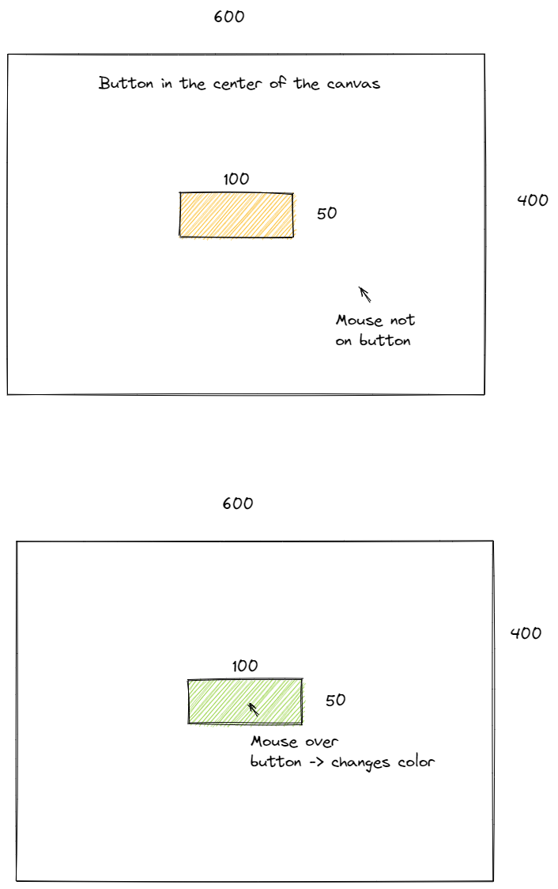

# Buttons

## Requirements
* Create a rectangle in the center of the canvas.
* The rectangle should be no larger than width 100 and height 50.
* Write the a conditional statement so that the color of the rectangle changes only when the mouse is hovering on the rectangle. 
* The color of the rectangle should change back when the mouse is not hovering over the rectangle.
* The color of the rectangle should not flicker or rapidly change, it should be a solid color.
* For help with this assignment watch this video: [https://youtu.be/r2S7j54I68c?list=PLRqwX-V7Uu6Zy51Q-x9tMWIv9cueOFTFA](https://youtu.be/r2S7j54I68c?list=PLRqwX-V7Uu6Zy51Q-x9tMWIv9cueOFTFA)

## Challenges (Complete at least one):
* Add a second rectangle that changes color only when you click on the second rectangle.
    * *Hint: you may need to use one of the built in mouse functions or variables in P5JS. https://p5js.org/search/?term=mouse may help*
* Create a button that works the same as the first but is a circle rather than a rectangle.
* Create an small unclickable button that when you try to hover over it, the button moves away from the mouse, so it can never be clicked or hovered over.

For help with the challenges watch this video: [https://youtu.be/r2S7j54I68c?list=PLRqwX-V7Uu6Zy51Q-x9tMWIv9cueOFTFA](https://youtu.be/Rk-_syQluvc?list=PLRqwX-V7Uu6Zy51Q-x9tMWIv9cueOFTFA)

## Grading
|Requirement | pts possible| pts earned|
|--- |:-:| :-:|
|Rectangle button in the center of the screen that is no larger than width 100 and height 50 |1|
|Rectangle button is colored and does not flicker|1|
|When the mouse hovers over the button, it changes color|3|
|When the mouse is not hovering over the button, it changes back to the original color|3|
|Create 2nd rectangle that only changes color when it is clicked|2|
|Create a circle or ellipse shaped button. It can work like either of the rectangle buttons.|2|
|Create an unclickable button that as soon as the mouse hovers over it, the button teleports somewhere else.|1|
|Total Possible:|10||
